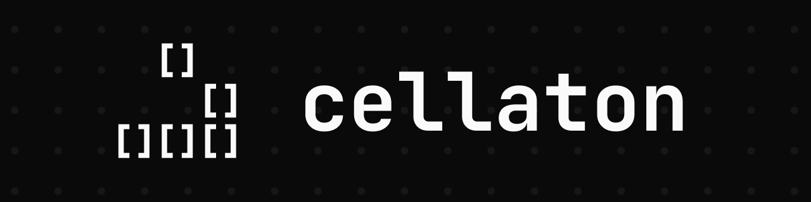
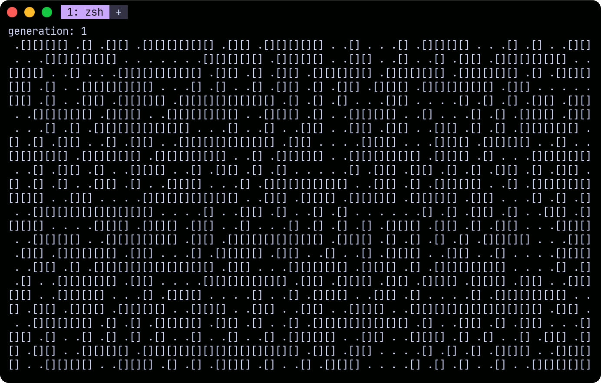

## What is cellaton?

"cellaton" is a cellular automaton go module

## Showcase

```go
// game_of_life.go

func main() {
    // define width, height, rules, and neighborhood pattern
	field := cellaton.NewField(48, 24, rules.Gof, neighborhood.Moore)
	field.FillRand(50)

	for {
		field.NextGen()
		fmt.Printf(
			"generation: %v\n%v",
			strconv.Itoa(field.GetGeneration()),
			cellaton.CellsToString(field.GetCells(), "[]", " ."),
		)
		time.Sleep(100 * time.Millisecond)
	}
}
```


## License

This project is licensed under the [MIT License](LICENSE.md).